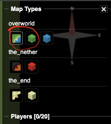

# Terraform-X-Minecraft
## Intro

Welcome to your introduction to Infrastructure as Code with Terraform. Today we are going to show the basic principles of IaC as well as Terraform functionality by managing the infrastructure in the Minecraft world. 

## Initial setup

As long as you are registered for the event you can request your environment at [lab.devopsplayground.org](https://lab.devopsplayground.org/)
We created a virtual machine for you with a terminal and IDE, as well as a running Minecraft server. We installed the mode so you can render the world in the browser. There are different views available, but for this workshop, we are going to use flat and 3d-view as shown in the screenshot below:

<p align="center">
  
</p>

While this setup does not require you to install anything, it comes with some limitations. The rendering needs to be triggered from the Minecraft server. For your convenience we've added the following commands to be used on the instance:

```bash
render-flat # renders the flat map
render-3d # renders the 3d map
render-stop # stops rendering *note - full 3d render takes ~30mins so we advise you to build any 3d structure near the spawn point (152,64,152), rendering is executed in the radius of the spawn so you should see the results in a few minutes if you build there
mc-logs # logs of Minecraft server - you can see the status and progress of your rendering, as well as any calls terraform, makes to the server
```
#### <b>Note:</b> If you have your own Minecraft licence and Minecraft client installed - feel free to log in to the server and see the changes to your world in real time without the need to render.
If you plan to log into the server you may wish to run the following commands to make it a little easier to see what you build.
```bash
docker exec mc mc-send-to-console /op <your Minecraft name>
docker exec mc mc-send-to-console /gamerule doDaylightCycle false
docker exec mc mc-send-to-console /gamerule doWeatherCycle false
docker exec mc mc-send-to-console /time set noon
```

## DIY
If you would like to replicate this setup on your machine you will need to:
1. Install Terraform [docs](https://developer.hashicorp.com/terraform/tutorials/aws-get-started/install-cli)
2. Configure Minecraft server - We used docker image to run it and you can find the exact configuration in `minecraft.sh`

## Agenda
The session should take ~60 minutes and attendees do not need to have any previous experience. If you are already a terraform guru - at the end of the session, we encourage everyone to build something cool - that will be your time to shine!

### <b>Here is what we are going to cover:</b>

### [Lab_1 - Let's start with the dot](./lab_1/README.md): 

    - Terraform setup - configuring and initialising the provider
    - Creating and deploying your first terraform resource and talking about terraform state
    - Using variables
    - Creating and managing multiple resources
    - Building your first Minecraft structure
    
### [Lab_2 - I am going to build a wall](./lab_2/README.md):

    - Introducing basic functions
    - Using functions to define the structures
    - Introducing terraform modules
    - Using Terraform modules and Terraform functions to build more complex structures 

### [Lab_3 -  Time to get creative!](./lab_3/README.md):

    - Minecraft alphabet 
    - Panda module and more...
    - Show us what you have got!
