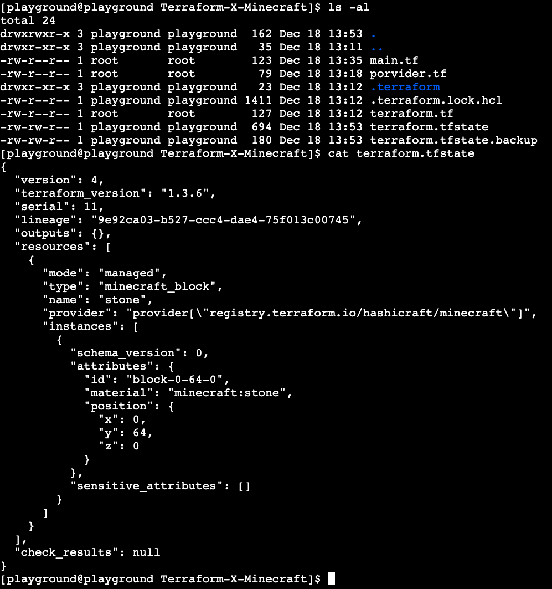
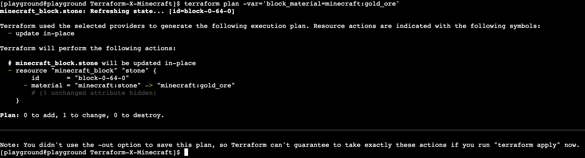
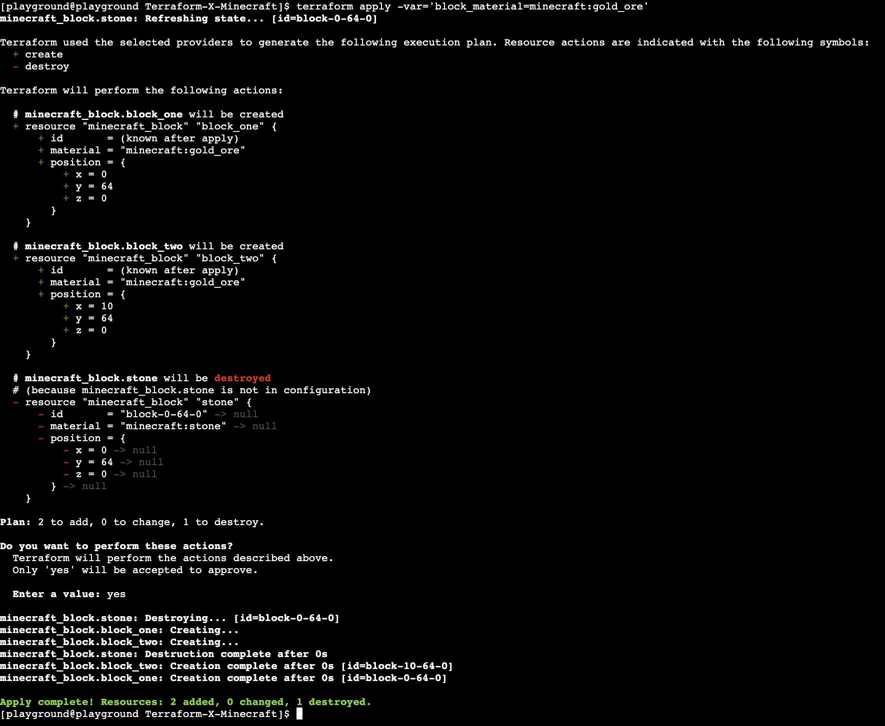
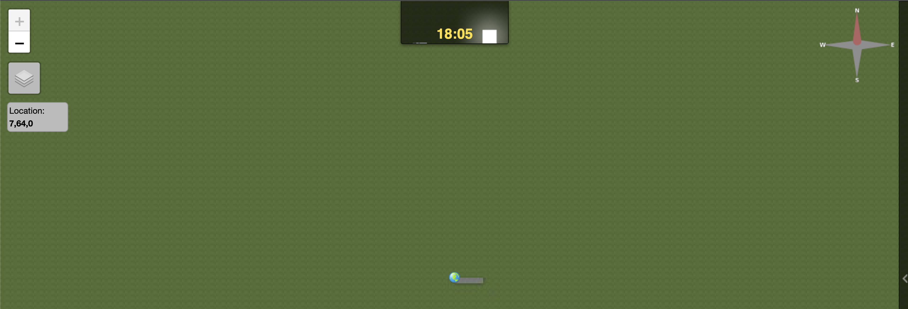

# Let's start with the dot

## Configuring provider
Our very first step will be to define and cofigure our terraform provider. Lets navigate in our terminal to the directory where we will keep our terraform code. You can do this by typing 
```bash
cd /home/playground/workdir/Terraform-X-Minecraft
```
In another tab let's open our IDE and in the same directory create `terraform.tf` file. In this file we will define our terraform configuration and for today's workshop all we need is our minecraft provider. Copy the snippet below:
```go
terraform {
  required_providers {
    minecraft = {
      source  = "HashiCraft/minecraft"
      version = "0.1.1"
    }
  }
}
```
We will work on the very simple use case today, but in more advanced configurations we may have multiple provider and i.e. remote backend configured in this file

We instructed terraform which version of the provider to use, now we need to configure it. Create `provider.tf` file in the same directory and copy the snipet below:
```go
provider "minecraft" {
  address  = "127.0.0.1:25575"
  password = "PandaTime"
}
```
In this case we provide a password as string which of course is not adivsible. Terraform can integrate with secret managing servies like i.e vault or use credentials from the environment i.e. evrionment variables, aws credential file etc.

Now we can initilise our provider by going back to the window with our terminal and execuiting
```bash
terraform init
```
The output hould look like below:

<p align="center">
  
</p>

<b>Note</b> Terraform created a hidden directory where the provider executable was downloaded as well created the dependancy file.

## Creating your first resource 

Our next step is to create and then deploy our first resource. Let's create `main.tf` file in the `/home/playground/workdir/Terraform-X-Minecraft` dicrectory. To define a resource we need to provide the required input arguments. In this case we need to define them all, but in the different providers some or even all of the inputs might be optional. Please use the coordinates as below so you can follow your work in the view easier - you can access it at `<your-panda>.devopsplayground.org:8123`

```go
resource "minecraft_block" "stone" {
  material = "minecraft:stone"

  position = {
    x = 0,
    y = -60,
    z = 0,
  }
}

```
Once you saved the file, please run the following commands from your termainal (make sure that you are in the `/home/playground/workdir/Terraform-X-Minecraft` directory)
```bash
pwd # check if we are in the right directory
terraform plan
terraform apply
```
After running terraform apply type `yes` to confirm the plan. Your output should look like below.
<p align="center">
  
</p>

Once your plan is appplied - please type the command below to refresh the view of your world:
```
render-flat
```
After ~60 seconds you should see your block at `<your-panda>.devopsplayground.org:8123`

## Terraform state
Once we applied the configuration - lets have a quick look on what kind sorcerry terraform did for us behind the scenes. Lets type:

```bash
ls-al
cat terraform.tfstate
```

Your output should look like below: 

<p align="center">
  
</p>

<b>Note</b>: Terroform created the state file where the current state of your infrastructure is captured. When running a plan - terraform will refer to the state to see how your desired state is deffernet from your current state. The state can be configured to be stored remotely (i.e. terraform cloud, S3) so all your engineers have the same information to execute against. You can use `terraform state <option>` commands to manipulate your state.

## Using variables
Terraform is making the use of vaiables we can define and use in our configurations. Let's create a `variables.tf` file in the `/home/playground/workdir/Terraform-X-Minecraft` directory and paste the following:
```go
variable "block_material" {
    type = string
    default = "minecraft:stone"
    description = "Type of material you are using for your structure - different materials will have different colours"
}

variable "position" {
  type = object({
    x = number
    y = number
    z = number
  })

  default = {
    x = 0,
    y = -60,
    z = 0
  }
}
```
You can see the we can define simple variables like strings or integers as well as more complex objects. You can find more about inpout variables in the [documentation](https://developer.hashicorp.com/terraform/language/values/variables). Now we also need to edit our `main.tf` file to make use of our variables.
```go
resource "minecraft_block" "stone" {
  material = var.block_material

  position = {
    x = var.position.x,
    y = var.position.y,
    z = var.position.z,
  }
}
```
We can now run:
```
terraform plan
```
You should see no changes to do as our default value for the variable was the same as previously defined. That default values can be override see the [documentation](https://developer.hashicorp.com/terraform/cloud-docs/workspaces/variables) to see more details and precedence they take. At the very top will be the cli argument so let's give it a try:
```bash
terraform plan -var='block_material=minecraft:gold_ore'
```
Your output should look like below:
<p align="center">
  
</p>
We are not going to apply it just yet, at fir  we are going to add anoter resource to our `main.tf` file. It should look like below now:

```go
resource "minecraft_block" "block_one" {
  material = var.block_material

  position = {
    x = var.position.x,
    y = var.position.y,
    z = var.position.z,
  }
}

resource "minecraft_block" "block_two" {
  material = var.block_material

  position = {
    x = var.position.x + 10,
    y = var.position.y,
    z = var.position.z,
  }
}
```
<b>Note</b>: Each resource we create needs to have a unique name hence we have `block_one` and `block_two`. You can imagine how long our configuration will get when we start building something more complex right? Don't worry - we will cover how two deal with this in the next labs! 
Please also note how in the 2nd block we used our vaiable with simple math and therefore changed the coordinates for our block. We can run a our apply now and let's override our `block_material` variable again.

```bash
terraform apply -var='block_material=minecraft:gold_ore'
```

Your output should look like below:

<p align="center">
  
</p>

<b>Note</b>: This time our good old block was destroyed before we created a new one in it is place. Your previous plan was suggesting the change in-place instead. This is because we change our resource name in the configuration. Certain operations will force the resources to be recreated whcih might be crucial for your runs i.e. chaning a tag will be most likely change in place while rewriting a bootstap script for your virtual machine will most likely cause the recration of the resource. In the bigger configuration this could have a cascading effect.

Now lets refresh our world by running and see the changes we made.

```bash
render-flat
```

You should see two blocks not so apart from each other. Time to make our first "structure" - the line. Please copy the snippet below to your `main.tf` file.

```go
resource "minecraft_block" "block_one" {
  material = var.block_material

  position = {
    x = var.position.x,
    y = var.position.y,
    z = var.position.z,
  }
}

resource "minecraft_block" "block_two" {
  material = var.block_material

  position = {
    x = var.position.x + 1,
    y = var.position.y,
    z = var.position.z,
  }
}

resource "minecraft_block" "block_three" {
  material = var.block_material

  position = {
    x = var.position.x + 2,
    y = var.position.y,
    z = var.position.z,
  }
}

resource "minecraft_block" "block_four" {
  material = var.block_material

  position = {
    x = var.position.x + 3,
    y = var.position.y,
    z = var.position.z,
  }
}
resource "minecraft_block" "block_five" {
  material = var.block_material

  position = {
    x = var.position.x + 4,
    y = var.position.y,
    z = var.position.z,
  }
}
```

Now lets run apply followed by `yes`:

```bash
terraform apply
```

Then refresh our world again:

```bash
render-flat
```

Your flat world view should look like below now:

<p align="center">
  
</p>

That is for the first lab! Time to take it up a notch and move to the [Lab_2 - I am going to build a wall...](../lab_2/README.md)!