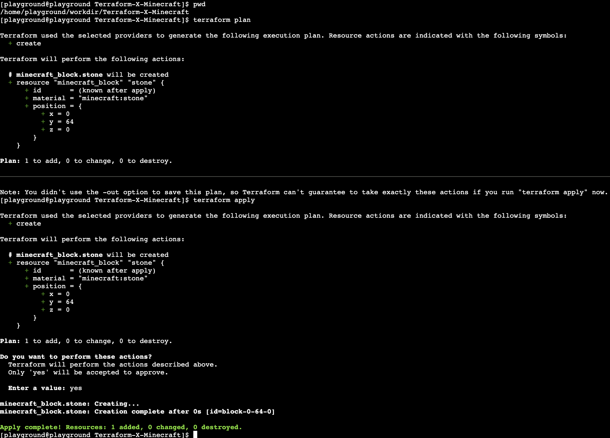

# Let's start with the dot

## Configuring provider
Our very first step will be to define and cofigure our terraform provider. Lets navigate in our terminal to the directory where we will keep our terraform code. You can do this by typing 
```bash
cd /home/playground/workdir/Terraform-X-Minecraft
```
In another tab let's open our IDE and in the same directory create `terraform.tf` file. In this file we will define our terraform configuration and for today's workshop all we need is our minecraft provider. Copy the snippet below:
```go
terraform {
  required_providers {
    minecraft = {
      source  = "HashiCraft/minecraft"
      version = "0.1.1"
    }
  }
}
```
We will work on the very simple use case today, but in more advanced configurations we may have multiple provider and i.e. remote backend configured in this file

We instructed terraform which version of the provider to use, now we need to configure it. Create `provider.tf` file in the same directory and copy the snipet below:
```go
provider "minecraft" {
  address  = "127.0.0.1:25575"
  password = "PandaTime"
}
```
In this case we provide a password as string which of course is not adivsible. Terraform can integrate with secret managing servies like i.e vault or use credentials from the environment i.e. evrionment variables, aws credential file etc.

Now we can initilise our provider by going back to the window with our terminal and execuiting
```bash
terraform init
```
The output hould look like below:

<p align="center">
  
</p>

<b>Note</b> Terraform created a hidden directory where the provider executable was downloaded as well created the dependancy file.

## Creating your first resource 

Our next step is to create and then deploy our first resource. Let's create `main.tf` file in the `/home/playground/workdir/Terraform-X-Minecraft` dicrectory. To define a resource we need to provide the required input arguments. In this case we need to define them all, but in the different providers some or even all of the inputs might be optional. Please use the coordinates as below so you can follow your work in the view easier - you can access it at `<your-panda>.devopsplayground.org:8123`

```go
resource "minecraft_block" "stone" {
  material = "minecraft:stone"

  position = {
    x = 0,
    y = 64,
    z = 0,
  }
}

```
Once you saved the file, please run the following commands from your termainal (make sure that you are in the `/home/playground/workdir/Terraform-X-Minecraft` directory)
```bash
pwd # check if we are in the right directory
terraform plan
terraform apply
```
After running terraform apply type `yes` to confirm the plan. Your output should look like below.
<p align="center">
  
</p>