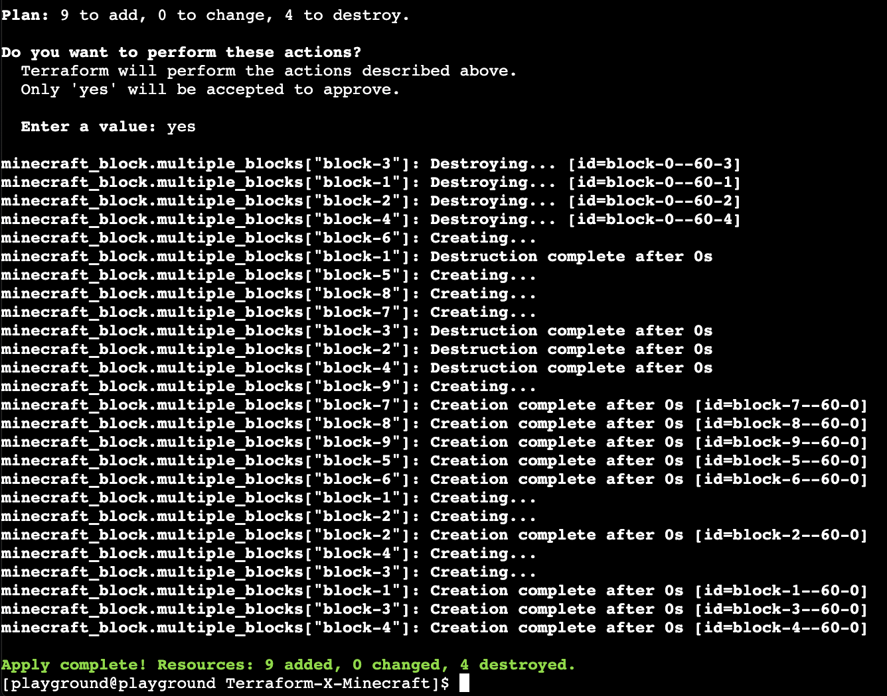

# I am going to build a wall...

## Introducing locals and functions
We should now know how to create resources and use variables. In terraform we can also use locals which cannot you override from the cli. There are different approaches and use cases for when you should use one or another which we will not full cover today, but one of the examples below will be a great use case for using locals. 
We will also leverage the terrafrom functions to make our code cleaner and more reusable as placing hundread blocks in the same manner we did in the previous excersise would be a tedious task. We are a going to use a `for_each` fucntion in our first step - to learn more about what is availible for you - see the [documentation](https://developer.hashicorp.com/terraform/language/functions). Please go to your `main.tf` file and replace it is content with the snippet below: 

```go
locals {
    list_of_blocks = [
        {
            x = 0
            y = -60
            z = 0
        },
        {
            x = 0
            y = -60
            z = 1
        },
        {
            x = 0
            y = -60
            z = 2
        },
        {
            x = 0
            y = -60
            z = 3
        },
        {
            x = 0
            y = -60
            z = 4
        }
    ]
}


resource "minecraft_block" "multiple_blocks" {
  for_each = { for i, o in local.list_of_blocks : "block-${i}" => o }

  material = var.block_material

  position = {
    x = each.value.x,
    y = each.value.y,
    z = each.value.z
  }
}
```

We created a list of coordinates in our locals and we use `for_each` to create a resource for every coordinate availible. You can now run the command below followe by `yes`

```bash
terraform apply
```
Terraform should attempt to remove your old line and make a new one on a different axis. Your output should look like below:

<p align="center">
  
</p>

You may need to refresh your map by running:

```bash
render-flat
```

## Fair square
In our next step we will use `setproduct` and `range` functions to create the list of coordinates for us, rather than creating it ourselves.Lets go to our `main.tf` again and modify the locals block.

```go
locals {
    list_of_coordinates = setproduct(range(var.width), [-60], range(var.length))
}
```
<b>Note</b>: We left -60 intentionally as this will define our ground level. 

Range function while provided with only one argument (integer) it will produce a list of numbers within that range starting from 1 and not including the number. There is more to it so if you feel adventurous go to the [documentation](https://developer.hashicorp.com/terraform/language/functions/range).

The `setproduct` function will take multiple lists and create objects with all possible variations for the data in the lists - for more details go to the [documentation](https://developer.hashicorp.com/terraform/language/functions/setproduct)

The above will give us list of coordinates looking like:

```go
[
    0,
    -60,
    0,
]
```
We have all the values, but we are still missing the keys. We are going to use a `zipmap` function to solve this problem. More about `zipmap` in the [documentation](https://developer.hashicorp.com/terraform/language/functions/zipmap)

Add another line to your `locals` block in `main.tf` file so it looks like below:
```go
locals {
    list_of_coordinates = setproduct(range(var.width), [-60], range(var.length))
    list_of_blocks = [for block in local.list_of_coordinates : zipmap(["x", "y", "z"], block)]
}
```
In the above example we use for loop to transform our lists of coordinates to the maps we can use.


Let's now move to our `variables.tf` file and define the `width` and the `length` of our line.

```go
variable "width" {
    type = number
    default = 10
}

variable "length" {
    type = number
    default = 1
}
```

In this case we transform the data within the locals block and use it as the input. Anyone running/applying this configuration wether from CLI or CI/CD pipeline does not need to worry about how it is done. All they need to worry about is to provide desired `width` and `length`

Once your file are updated you can run the `terraform apply` followed by `yes`

Your output should look like:

<p align="center">
  
</p>

You may need to refresh your map by running:

```bash
render-flat
```
Now by just adjusting your width and length you could build a flat rectangle or line, that sounds like something 