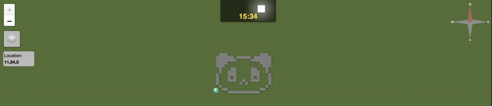
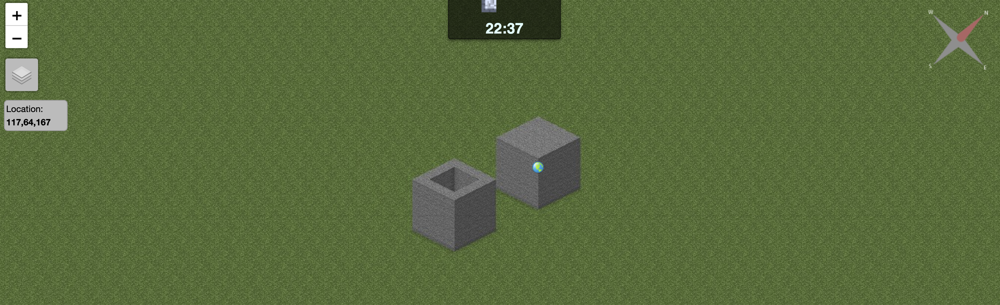
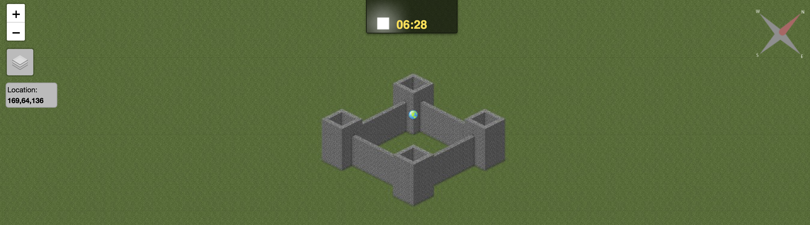

# Time to get creative!
## Alphabet
Now that we proved that we can build something useful and reuse it with modules imagine that there is a community of talented engineers sharing modules for everyone to use. For terraform that will be the [registry](https://registry.terraform.io/browse/modules). In this step, we are going to use an existing module to write text in the Minecraft world.

Let's get to our `main.tf` file and remove our cube module and replace it with the snippet below:
```go
module "minecraft_words" {
  source   = "git::https://github.com/DevOpsPlayground/minecraft_alphabet_module.git"
  material = "minecraft:stone"
  string   = "Hello Pandas!"

  position = {
    x = 0
    y = -60
    z = 0
  }
}
```
We are going to leverage the great work our colleague [Massi](https://www.linkedin.com/in/massimilianovallascas/) did - you can replace string - with the string of your choice - Just don't go too crazy - an essay may not fit in your map!. Of course, you can go to the [github repository](https://github.com/DevOpsPlayground/minecraft_alphabet_module) to see this module with Readme and the examples of how to use it. Before you are going to do that - let's run the commands below while in the `/home/playground/workdir/Terraform-X-Minecraft` directory:
```bash
terraform init
ls .terraform/modules/minecraft_words/
```
You should see that terraform downloaded the module to the hidden directory. That is why every time we use a different version or a completely new module you will need to run `terraform init`.
Once you have our module ready to use let's run:
```bash
terraform apply
```
Followed by `yes`, and then
```bash
render-flat
```
It might take a minute to render but you should see your text written all over your world shortly.

## Panda module and more....

Thanks to Massi we have a few more modules for you. Of course, we could not have a Playground without the panda so let's go to our `main.tf` file and replace our alphabet module with the following.
```go
module "panda" {
  source   = "git::https://github.com/DevOpsPlayground/terraform_minecraft_playground.git//panda"
  material = "minecraft:stone"

  position = {
    x = 0,
    y = -60,
    z = 0,
  }
}
```
Note that this time we will get our module as a sepcific directory within `terraform_minecraft_playground` repository. You can store multiple modules in one repository and call them separately. Let's run:
```bash
terraform init
terraform apply
```
Followed by `yes` and then to see your message being replaced with Panda execute:
```bash
render-flat
```
In a minute you should see a beautiful panda like on the picture below:

<p align="center">
  
</p>

We have two more creations from Massi for you to use so let's got back to our `main.tf` file and replace it with blow:
```go
module "cube" {
  source = "git::https://github.com/DevOpsPlayground/terraform_minecraft_playground.git//cube"
  material = "minecraft:stone"

  position = {
    x = 0,
    y = -60,
    z = 0,
  }

  dimensions = {
    width  = 5,
    length = 5,
    height = 5
  }
}

module "hollow-cube" {
  source = "git::https://github.com/DevOpsPlayground/terraform_minecraft_playground.git//square"
  material = "minecraft:stone"

  position = {
    x = 0,
    y = -60,
    z = 10,
  }

  dimensions = {
    width  = 5,
    length = 5,
    height = 5
  }
}
```
We have a module to create a cube (Yes we made one already, but using a flat square module) and the hollow cube. They take `position` and `dimensions` as well as `material` as input. Let's try to deploy the above to see what they look like.

Let's run:
```bash
terraform init
terraform apply
```
Followed by `yes` and then to see your panda being replaced with cubes execute:
```bash
render-flat
```
Your world should look like below now:

<p align="center">
  
</p>

## Time to rule the world
We were lazy with the last exercise so it is up to you what you want to build. You can use the tools we covered so far or take them to a different level with your creativity. You can use different materials - see [the list here](https://www.minecraftinfo.com/idnamelist.htm) and use different [terraform functions etc...](https://developer.hashicorp.com/terraform/language)
Just to give you a nudge towards what you can build here is an example of a beautiful castle built using only a hollow-cube module. Feel free to go to `main.tf` file and replace your code with:
```go
locals {
  origin = {
    x = 0,
    y = -60,
    z = 0,
  }

  towers = {
    material = "minecraft:cobblestone",
    distance = 15,
    width    = 6,
    height   = 10,
    length   = 6
  }

  wall = {
    material = "minecraft:cobblestone",
    width    = 1,
    height   = 3,
    length   = 2
  }
}

module "tower1" {
  source = "git::https://github.com/DevOpsPlayground/terraform_minecraft_playground.git//square"

  material = local.towers.material

  position = {
    x = local.origin.x,
    y = local.origin.y,
    z = local.origin.z
  }

  dimensions = {
    width  = local.towers.width,
    height = local.towers.height,
    length = local.towers.length
  }
}

module "wall12" {
  source = "git::https://github.com/DevOpsPlayground/terraform_minecraft_playground.git//square"

  material = local.wall.material

  position = {
    x = local.origin.x + floor(local.towers.width / 2),
    y = local.origin.y,
    z = local.origin.z + floor(local.towers.length / 2)
  }

  dimensions = {
    width  = local.towers.distance + local.towers.width,
    height = ceil(local.towers.height * 2 / 3)
    length = local.towers.distance + local.towers.width
  }
}

module "tower2" {
  source = "git::https://github.com/DevOpsPlayground/terraform_minecraft_playground.git//square"

  material = local.towers.material

  position = {
    x = local.origin.x + local.towers.width + local.towers.distance,
    y = local.origin.y,
    z = local.origin.z
  }

  dimensions = {
    width  = local.towers.width,
    height = local.towers.height,
    length = local.towers.length
  }
}

module "tower3" {
  source = "git::https://github.com/DevOpsPlayground/terraform_minecraft_playground.git//square"

  material = local.towers.material

  position = {
    x = local.origin.x,
    y = local.origin.y,
    z = local.origin.z + local.towers.length + local.towers.distance
  }

  dimensions = {
    width  = local.towers.width,
    height = local.towers.height,
    length = local.towers.length
  }
}

module "tower4" {
  source = "git::https://github.com/DevOpsPlayground/terraform_minecraft_playground.git//square"

  material = local.towers.material

  position = {
    x = local.origin.x + local.towers.width + local.towers.distance,
    y = local.origin.y,
    z = local.origin.z + local.towers.length + local.towers.distance
  }

  dimensions = {
    width  = local.towers.width,
    height = local.towers.height,
    length = local.towers.width
  }
}
```
And now if you want to see the castle at full glance let's run:
```bash
terraform init
terraform apply
```
Followed by `yes` and then to see your cubes being replaced with a building execute:
```bash
render-flat
```
Your world should look like below now:

<p align="center">
  
</p>

<b>Note</b> It may take a minute before the structure fully renders. If it does not appear in your 3d view you may need to execute `render-3d`. 3d rendering takes quite some time but starts from 0,-60,0 so you should see the results quickly. Just remember to run `render-stop` before using it again.

## Now go and build a better world! Using terraform of course! :) 

Thanks for joining our session today! Stay tuned for the announcements on our [meet-up page](https://www.meetup.com/devopsplayground/) if you can't wait for the next one!